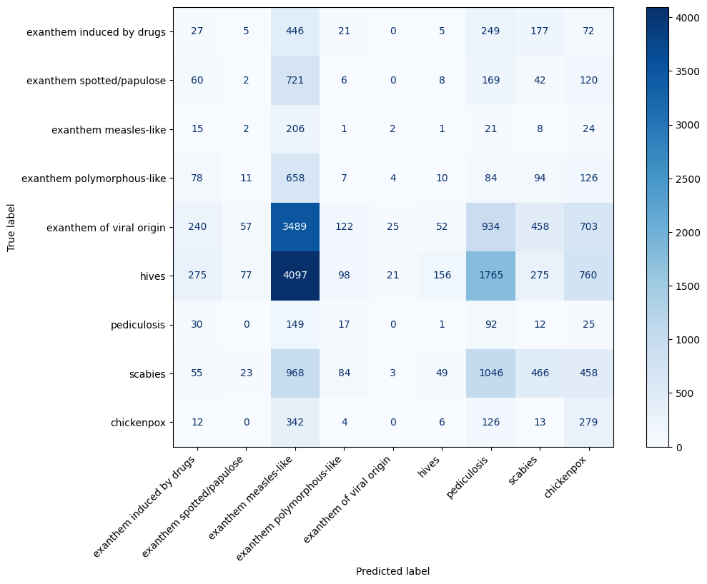

# Ethics in Artificial Intelligence Project
# Assessing Bias in Multi-Modal Models: A Study of CLIP on Gender and Skin Tone

## Abstract

In the past years, self-supervised learning emerged as a new paradigm to learn more expressive embeddings of the input itself. It is especially used in Large Language Models, like BERT, to learn contextual representations of words. Given the intrinsic structure of the Transformer Encoder learning block capable of accepting every type of input, in the successive years, this architecture has been employed in the processing of other modalities, such as images; and, as a step forward, CLIP was presented with the aim of creating a Multi-Modal Model connecting image and text representations in a shared embedding dimensionality, learned from a huge amount of (image, text) pairs collected from the internet.

As a result of this training methodology, that allows it to learn from any type of data in a self supervised way, this model can also be used to perform zero-shot classifications of images. But, given the huge amount of data on which the model is trained, it could highlight and enhance bias that exists in society and is inherited from the data itself, generating discrimination if used in critical applications. This project has two different goal: understand if the use of a Multi-Modal Model, such as CLIP, could increase the bias compared to a BERT model, that is trained on text data only, and understand if the zero-shot capabilities of image could be biased toward skin tone.

## Description

In a previous study [1] done on BERT [2], it was highlighted how the contextual embedding learned by this model is strictly linked to social bias inherited from the data on which it was trained on.

In the CLIP model [3] the training objective is to minimize the distance between the embedding of the (image, text) pairs in the dataset, using a contrastive learning methodology, in order to create a mapping between these two different input modalities in a shared embedding space. After their test, the authors noted the presence of bias in the model related to gender and skin tone.

### Goal

#### Assessing bias in assigning job positions (Task 1)

In this project I would like to quantify this bias in both models to understand if the use of a Multi-Modal Model, that can process information from both text and images, could enhance this bias. I will focus this study on gender and the skin tone, to verify the bias related to the correlation between them and work positions, in a way similar to [1]. To extract this information I will query both models with different methodologies, due to their different natures:

* BERT will be queried with the same methodology defined in [1]
* CLIP will be queried by inputting different images representing male and female persons, with different skin tones, along with text related to the job position; then a cosine similarity between the generated embeddings will be used to assess the bias.

The comparison between the output generated by the models will be summarized in tables to understand if the visual information could emphasize the bias inherited from the input data.

#### Assessing bias in zero-shot classification of dermatological disease (Task 2)

The authors of CLIP highlighted how this model is able of zero-shot capabilities, but they signal the presence of bias toward skin tone, so in this project I would like to understand the behaviour of this Multi-Modal Model in the zero-shot classification of images representing different dermatological disease, a fine task related to a critical application.

### Deliverables

In a github repository, the notebook showing both the code and the output generated by the models will be delivered, along with the data used to query the models and a detailed report that will explain the obtained results.

## Dataset

### Job skills dataset

The dataset used to assess the bias in assigning job position come from [1]. I leveraged two datasets: one focused on technical job skills and the other on tech job positions. The first one is small, containing only 25 data points, it is used to perform an initial test. Subsequently, I extended the results using a bigger dataset comprising 429 job positions from two major tech companies, Google and Amazon.

### Dermatological disease dataset

The original dataset consists of 10673 images representing nine different disease:
* exanthem induced by drugs (501 images)
* exanthem spotted/papulose (564 images)
* exanthem measles-like (140 images)
* exanthem polymorphous-like (536 images)
* exanthem of viral origin (3,040 images)
* hives (3,762 images)
* pediculosis (163 images)
* scabies (1,576 images)
* chickenpox (391 images).

To create a dataset with dark skin tones, this original dataset was augmented using a [script that alters skin tones](https://github.com/khanenab/skin-tone-changing). This process doubled the dataset size, resulting in a total of 21,346 images.

## Methodology

### Task 1

#### Analysis of the BERT model bias

The BERT model was trained using a masked language modelling objective, which allows me to leverage this characteristic to identify any bias inherited from the training data, as demonstrated in [1]. By constructing sentences that are processed by BERT and masking certain words with the special token [MASK], I can analyze the most probable words predicted for these masked tokens to understand the biases present in the model. Since the contextual information processed by the model may vary depending on the sentence, I decided to query the model with multiple types of sentences to obtain more precise results. The input sentences provided to the BERT model follow these structures:

* [MASK] _$sentence_type_ _$job_ to analyze the gender bias
* A [MASK] skin person _$sentence_type_ _$job_ to analyze the skin tone bias
* A [MASK] skin [MASK] _$sentence_type_ _$job_ to analyze both at the same time

In the first case, the model's output at the masked token position will be analyzed to estimate gender bias by comparing the probabilities of the words he and she. For skin tone bias, the probabilities of the words white and black will be compared. Finally, to analyze both biases simultaneously, the first masked token will be evaluated for skin tone bias, while the second masked token will be assessed for gender bias by considering the words man and woman. The final result for each category (e.g. "white man", "white woman", "black man", "black woman") is calculated by multiplying the probabilities of the corresponding words.

In the first dataset, the job refers to a skill related to the tech industry, and the sentence types used include "is good at" (as in [1]) as well as additional phrases such as "has expertise in", "is suitable for", "tipically works in" to provide a deeper analysis. In the second dataset, the sentence types used include "is a", "excels in the role of", "is a good candidate for", "usually works as a", "could become a". The final result for the BERT model can be computed as the average of the results obtained from each test.

#### Analysis of the CLIP model bias

The CLIP model is trained with the objective of minimizing the distance, in a shared embedding space, between the embeddings of the (text, image) pairs used as input.

To estimate the bias in assigning skills or job positions, I compute the cosine similarity between a text, representing the skill or the job position encoded using the CLIP text encoder, and the four embeddings representing each group. The closer a job position embedding is to a group embedding vector, the higher the probability that the job position is occupied by a person from that group. To generate the embeddings representing a group, I collected 10 images and generated an embedding vector by passing them through the CLIP image encoder. The final embedding is the mean of these individual embeddings.

Finally to obtain independently the skin and gender bias, I computed the mean embedding for each category. For example to obtain the embedding representing women, I computed the mean of the embeddings for "white woman" and "black woman". Another similarity search was then performed to obtain the final results. To do it, I used the NearestNeighbors object from the scikit-learn library [4].

### Task 2

In this part of the project, I perform zero-shot classification of dermatological diseases using the CLIP model. The methodology employed is similar to that described earlier. First, an embedding vector is generated for each text label, using the CLIP text encoder. Then, a nearest neighbor search is conducted with the embedding of the image representing the dermatological disease. To define the text labels I followed the same procedure used by the CLIP authors, so they are in the form of "a photo of a _$class_name_", with _$class_name_ being replaced by one of the dermatological disease listed above.

## Results

### Assessing bias in assigning skills and job positions

#### Gender bias

In the tables below I analyze the gender bias present in the BERT and CLIP models. Overall, both models exhibit similar behavior, showing nearly 100% preference for male pronouns. However, the bias in the Multi-Modal Model is slightly less pronounced, as noted in Table 2.

**Table 1: Gender bias in assigning skills**

| | man | woman |
|---|---|---|
| is good at | 96% | 4% |
| has expertise in | 100% | 0% |
| is suitable for | 96% | 4% |
| typically works in | 100% | 0% |
| BERT avg | 98% | 2% |
| CLIP | 100% | 0% |

**Table 2: Gender bias in the association of job positions**

| | man | woman |
|---|---|---|
| is a | 97.2% | 2.8% |
| excels in the role of | 99.1% | 0.9% |
| is a good candidate for | 99.1% | 0.9% |
| usually works as a | 97.9% | 2.1% |
| could become a | 98.4% | 1.6% |
| BERT avg | 98.3% | 1.7% |
| CLIP | 97.2% | 2.8% |

#### Skin tone bias

There are more significant differences between the two models when examining skin tone bias. As observed in the tables below, the CLIP model display an higher bias resulting in embeddings that are more similar to those related to individuals with white skin. This could be attributed to the training modality, which connects images to text, potentially leading the model to learn this type of bias. In contrast, BERT, which is trained solely on text, may find it more challenging to develop such bias. Additionally, the data used to train CLIP come from web queries, which may affect the dataset's quality and contribute to this problem.

**Table 3: Skin tone bias in assigning skills**

| | white | black |
|---|---|---|
| is good at | 100% | 0% |
| has expertise in | 40% | 60% |
| is suitable for | 100% | 0% |
| typically works in | 36% | 64% |
| BERT avg | 69% | 31% |
| CLIP | 92% | 8% |

**Table 4: Skin tone bias in the association of job positions**

| | white | black |
|---|---|---|
| is a | 42.2% | 57.8% |
| excels in the role of | 90.2% | 9.8% |
| is a good candidate for | 96.5% | 3.5% |
| usually works as a | 81.1% | 18.9% |
| could become a | 90.4% | 9.6% |
| BERT avg | 80.1% | 19.9% |
| CLIP | 99.5% | 0.5% |

Furthermore, it is important to note that the predictions made using using the BERT model could vary significantly based on the context, which in this case is provided by the sentence type. For instance, the results in Table 3 show notable differences between the first and second rows. This variability is also evident in the first two rows of Table 4, as well as in Tables 5 and 6.

#### Skin tone and gender bias overall

When queried to choose among the four categories, the results vary slightly. In Table 5, the gender bias is markedly high, with both models preferring women in 0% of cases. Regarding skin tone bias, BERT has more or less the same behaviour, but CLIP shows a somewhat less pronounced bias in this small dataset.

**Table 5: Bias in assigning skills**

| | white man | white woman | black man | black woman |
|---|---|---|---|---|
| is good at | 100% | 0% | 0% | 0% |
| has expertise in | 0% | 0% | 100% | 0% |
| is suitable for | 92% | 0% | 8% | 0% |
| tipically works in | 68% | 0% | 32% | 0% |
| BERT avg | 65% | 0% | 35% | 0% |
| CLIP | 76% | 0% | 24% | 0% |

Table 6 presents the performance of the models on the larger dataset concerning job positions. Here, a summary of the CLIP model's results reveals a strong bias towards both skin tone and gender. Overall, as previously anticipated, the skin tone bias is more enhanced in the Multi-Modal Model, while the gender bias is slightly less severe (BERT never chooses women, whereas CLIP selects them more frequently), though it remains significant. Again, this table shows that the predictions made by the BERT model are quite different based on the context.

**Table 6: Bias in the association of job positions**

| | white man | white woman | black man | black woman |
|---|---|---|---|---|
| is a | 24.5% | 0% | 75.5% | 0% |
| excels in the role of | 57.1% | 0% | 42.9% | 0% |
| is a good candidate for | 83.2% | 0% | 16.8% | 0% |
| usually works as a | 19.8% | 0% | 80.2% | 0% |
| could become a | 22.6% | 0% | 77.4% | 0% |
| BERT avg | 41.4% | 0% | 58.6% | 0% |
| CLIP | 93.5% | 5.1% | 1.2% | 0.2% |

### Zero-shot classification of dermatological disease

The execution of the CLIP model for the classification of dermatological disease yielded poor results on both the original dataset and the artificially created one. The image below presents a confusion matrix that summarize the results (similar confusion matrices were obtained during independent executions of the classification on both datasets).

Here it is shown that the majority of images are classified as "exanthem measles-like", and it cause a lot of misclassifications. The poor results are evident also from the metrics used for evaluation, as shown in Table 7.

**Table 7: Accuracy, precision, recall and F1-Score on the results obtained from the zero-shot classification of the CLIP model on the different set of images representing dermatological disease. Precision, recall and F1 are macro averaged.**

| | Global Accuracy | Global Precision | Global Recall | Global F1 Score |
|---|---|---|---|---|
| Original dataset | 0.0570 | 0.1764 | 0.1812 | 0.0614 |
| Dark skin dataset | 0.0611 | 0.1636 | 0.1705 | 0.0579 |
| Both | 0.0590 | 0.1678 | 0.1758 | 0.0590 |

Given that the results are close to random predictions, further analysis of skin tone bias is not feasible. However, Table 7 demonstrates that the results across four different metrics are similar for both datasets used in testing.

## Conclusion

As previously stated by the author themselves [3], the CLIP model is not immune from gender and skin tone biases. This study has shown that these biases are more pronounced compared to the BERT model, which is trained solely on text data and uses a smaller dataset. While the gender bias in CLIP is comparable to that of BERT, the skin tone bias is significantly higher. This discrepancy is likely due to the multimodal training approach, which links images to text and allows the model to more directly access skin tone features.

Regarding the use of this Multi-Modal Model for zero-shot classification of dermatological diseases, the results are barely distinguishable from random predictions. This highlights the model's poor performance on this specialized task and suggests that an architecture trained using supervised learning methods may be more suitable.

## References

[1] Keita Kurita, Nidhi Vyas, Ayush Pareek, Alan W Black, and Yulia Tsvetkov. Measuring bias in contextualized word representations, 2019. [GitHub Repository](https://github.com/keitakurita/contextual_embedding_bias_measure)

[2] Jacob Devlin, Ming-Wei Chang, Kenton Lee, and Kristina Toutanova. BERT: Pre-training of deep bidirectional transformers for language understanding, 2019.

[3] Alec Radford, Jong Wook Kim, Chris Hallacy, Aditya Ramesh, Gabriel Goh, Sandhini Agarwal, Girish Sastry, Amanda Askell, Pamela Mishkin, Jack Clark, Gretchen Krueger, and Ilya Sutskever. Learning transferable visual models from natural language supervision, 2021.

[4] Fabian Pedregosa, Gaël Varoquaux, Alexandre Gramfort, Vincent Michel, Bertrand Thirion, Olivier Grisel, Mathieu Blondel, Peter Prettenhofer, Ron Weiss, Vincent Dubourg, et al. Scikit-learn: Machine learning in python. Journal of machine learning research, 12(Oct):2825–2830, 2011.
